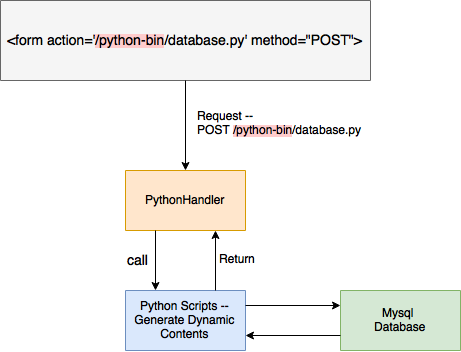
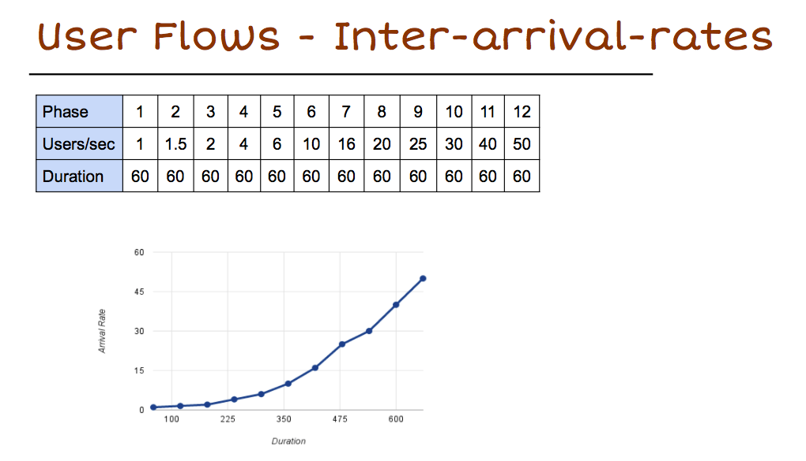
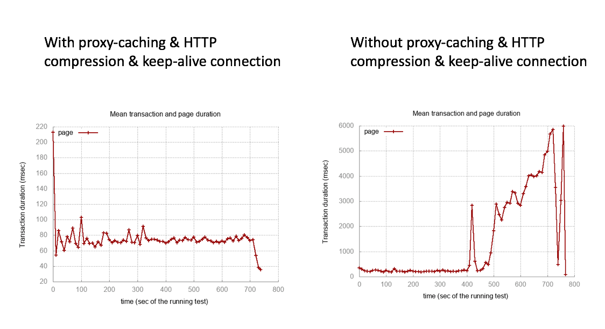
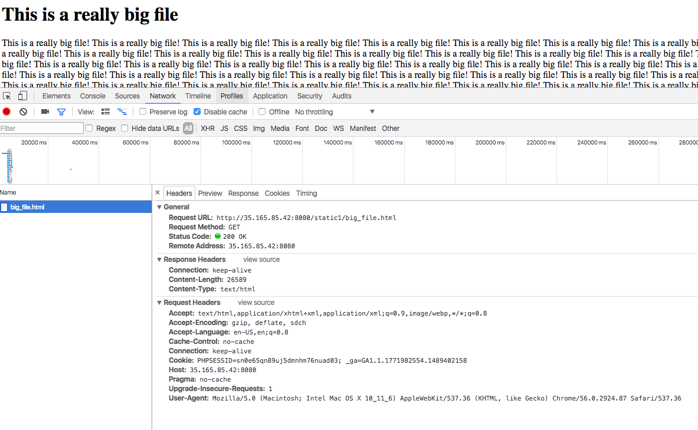
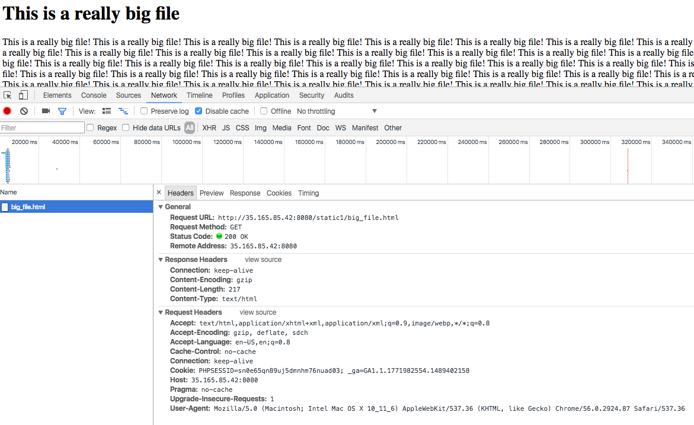
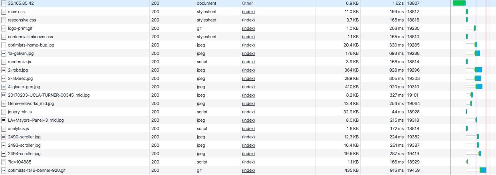
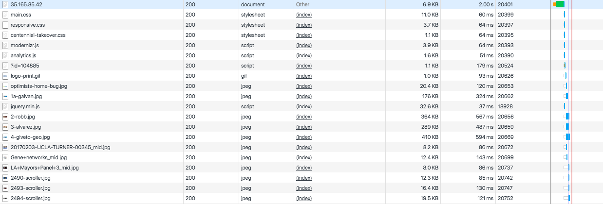

# A Simple Web Server -- Team TSC

## Features:
* ### Markdown Rendering
* ### Mysql Databse Interface
* ### A Python Application Server
* ### Load Testing
* ### HTTP Compression
* ### Keep-alive Connection
* ### A Cache Proxy

 
----- ----- ----- ----- ----- ----- ----- ----- ----- ----- ----- ----- -----
## Markdown Rendering
Using Cpp-Markdown lib. 
github: [https://github.com/sevenjay/cpp-markdown](https://github.com/sevenjay/cpp-markdown)

 
----- ----- ----- ----- ----- ----- ----- ----- ----- ----- ----- ----- -----
## Mysql Databse Interface
* Using libmysqlcppconn-dev.
* You can query the database, and add and delete rows from tables.
* demo: [http://35.165.85.42:8080/static1/database_test.html](http://35.165.85.42:8080/static1/database_test.html)

 
----- ----- ----- ----- ----- ----- ----- ----- ----- ----- ----- ----- -----
## A Python Application Server
* A PythonHandler to call python scripts and handle the data conversion between c++ and python.
* Python scripts can interact with database directly and generate dynamic contents.
* You can extend the python web server easily by adding python scripts in folder -- python-bin
* The main logic:

 
  

* demo: [http://35.165.85.42:8080/static1](http://35.165.85.42:8080/static1)
  
----- ----- ----- ----- ----- ----- ----- ----- ----- ----- ----- ----- -----
## Load Testing
* Use Tsung for load testing.
* User Flow and comparison:

 

 

 
----- ----- ----- ----- ----- ----- ----- ----- ----- ----- ----- ----- -----
## HTTP Compression
* some explanation
* Without Compression:

* With Compression:

* demo: [http://35.165.85.42:8080/static1/big_file.html](http://35.165.85.42:8080/static1/big_file.html)

  
----- ----- ----- ----- ----- ----- ----- ----- ----- ----- ----- ----- -----
## Keep-alive Connection

  
----- ----- ----- ----- ----- ----- ----- ----- ----- ----- ----- ----- -----
## A Cache Proxy

* The reverse proxy maintains its own cache
* Browsers may internally do their own caching, but requests to the reverse proxy from other browsers / clients will utilize the cache
* The cache is controlled by HTTP headers and functions similarly to browser caching, using Cache-Control to configure caching and etags to validate old copies of files
* Image comparison below shows the performance boost of caching. Pages load significantly faster on cache hits
* Without Cache:

* With Cache:

